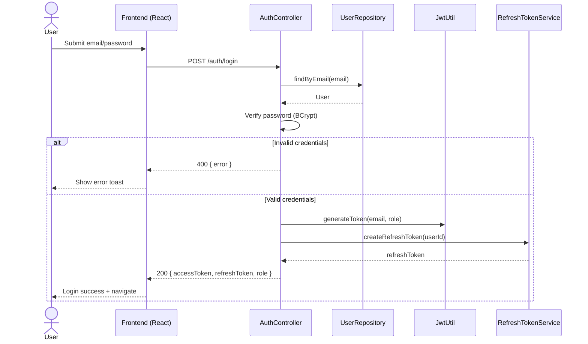
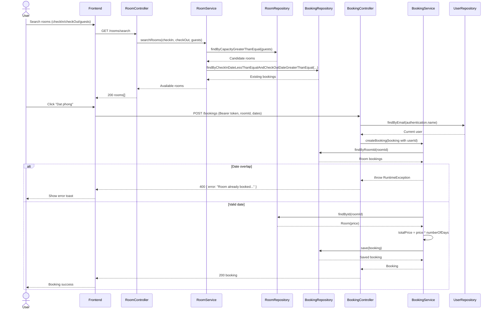

# Architecture Diagrams (Mermaid)

## 1. ERD
```mermaid
erDiagram
    USERS {
        string id PK
        string name
        string email UNIQUE
        string password_hash
        string role
        string gender
        string dateOfBirth
        string citizenId
    }

    HOTELS {
        string id PK
        string ownerId FK
        string name
        string address
        string city
        string imageUrl
    }

    ROOMS {
        string id PK
        string ownerId FK
        string hotelId FK
        string name
        int capacity
        double price
    }

    BOOKING {
        string id PK
        string userId FK
        string roomId FK
        date checkInDate
        date checkOutDate
        double totalPrice
    }

    REFRESH_TOKENS {
        string id PK
        string userId FK
        string token
        datetime expiryDate
    }

    USERS ||--o{ HOTELS : owns
    USERS ||--o{ ROOMS : owns
    HOTELS ||--o{ ROOMS : contains
    USERS ||--o{ BOOKING : creates
    ROOMS ||--o{ BOOKING : booked_in
    USERS ||--o{ REFRESH_TOKENS : has
```

## 2. Sequence Diagram - Login + Token Issue


## 3. Sequence Diagram - Search Room + Create Booking


## 4. Ghi chu su dung
- Ban co the dan truc tiep cac block Mermaid nay vao:
- GitHub Markdown (neu repo co ho tro Mermaid)
- Mermaid Live Editor
- Cong cu docs noi bo co plugin Mermaid
